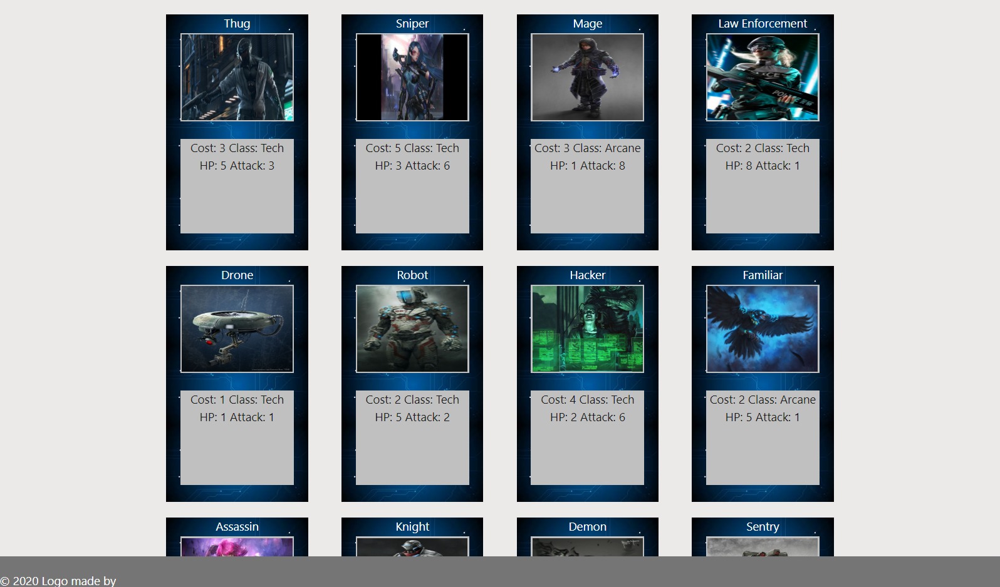
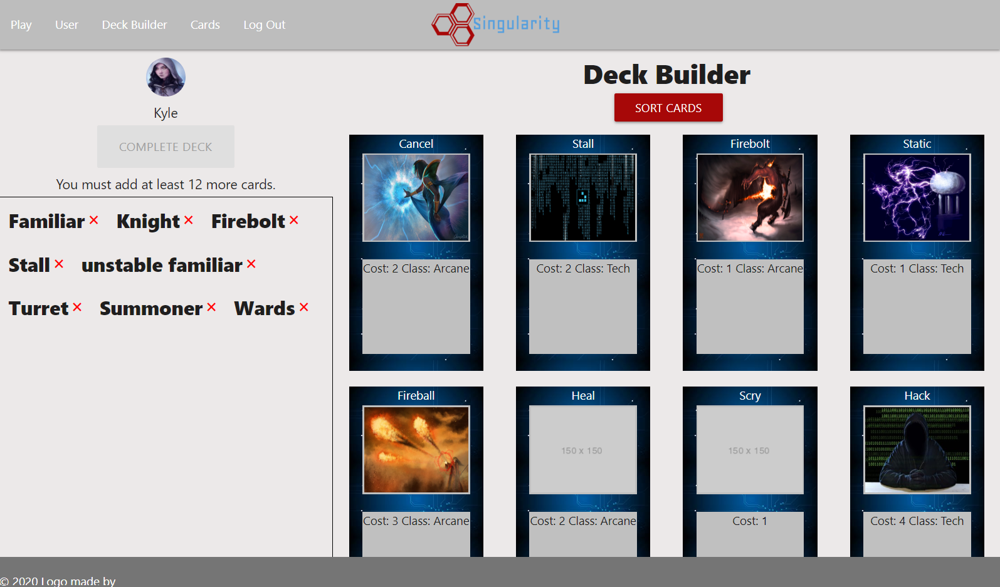
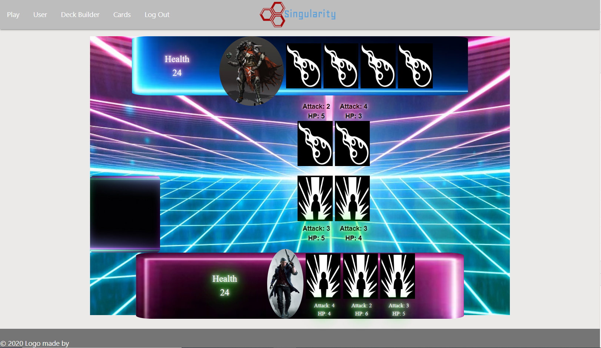

## Introduction:

Singularity is a competitive online card game. Upon creating an account, the user is able to create their own deck and face opponents. The goal is to eliminate your opponent before they eliminate you by attempting to get rid of their health points while protecting your own. This game features various classes and abilities to ensure dynamic and exciting gameplay.

[Access the application here.](https://singularitytcg.herokuapp.com/)

## Examples:

## Technologies:

         

## Contributors:

[Matt Marnien](https://github.com/mattmarien), [Vadim Buryakovsky](https://github.com/vadimsusername), [Marshall Dugan](https://github.com/marshdugan), and [Ethan Lacy](https://github.com/ethanl150).

## License:

This project is licensed under the ISC License.

